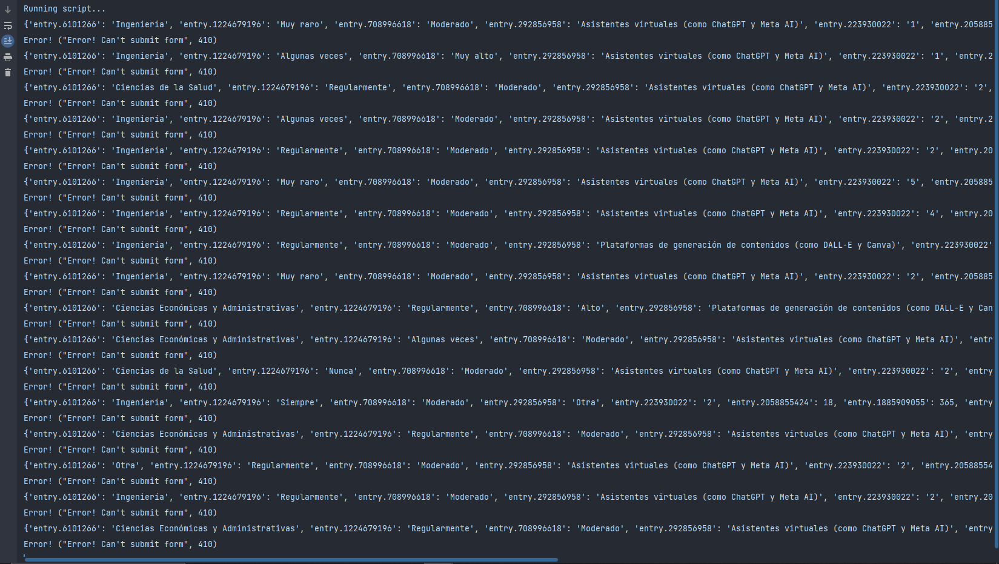

# GoogleFormsBot – Bot de Relleno y Envío Automático de Google Forms

**Versión:** 2.0.0  
**Fecha:** Septiembre 2024

> GoogleFormsBot permite generar respuestas simuladas y enviarlas automáticamente a formularios de Google Forms. Soporta tanto respuestas categorizadas con pesos probabilísticos como números enteros, decimales y múltiplos sesgados.

## Tabla de Contenidos
1. [Características](#características)  
2. [Requisitos](#requisitos)  
3. [Instalación](#instalación)  
4. [Uso Rápido](#uso-rápido)  
5. [Consideraciones](#consideraciones)  
6. [Limitaciones](#limitaciones)  
7. [Capturas de Pantalla](#capturas-de-pantalla)  
8. [Contribuir](#contribuir)  
9. [Agradecimientos](#agradecimientos)  
10. [Licencia](#licencia)  

## Características
- **Generación de datos sesgados**: opciones con pesos para respuestas categorizadas.  
- **Valores numéricos**: enteros, decimales y múltiplos de 5 o 10 con sesgos configurables.  
- **Módulo central configurable**: `bot.py` es donde se ajustan la URL del formulario, los `entry IDs` y las distribuciones de probabilidad.  
- **Automatización de envíos**: envía múltiples respuestas con pausas aleatorias para simular usuarios reales.  
- **Modularidad**: separación en `bot.py`, `form.py`, `generator.py` y `main.py` para extracción de campos, generación de datos y envío.

## Requisitos
- Python 3.7 o superior  
- Biblioteca `requests`  
- Acceso a internet para enviar peticiones POST a Google Forms

## Instalación
1. Clona este repositorio:  
   ```
   bash
   git clone https://github.com/TU-USUARIO/GoogleFormsBot.git
   cd GoogleFormsBot
   ```
2. Crea y activa un entorno virtual (opcional pero recomendado):
   ```
   python -m venv venv
   source venv/bin/activate   # Linux/macOS
   venv\Scripts\activate      # Windows
   ```
3. Instala las dependencias:
   ```
   pip install -r requirements.txt
   ```

## Uso Rápido
1. Ajusta en bot.py:
   - La constante URL al formResponse de tu formulario.
   - La función generate_survey_data() con tus preguntas y pesos.
2. Ejecuta el bot para enviar respuestas repetidas:
   ```
   python bot.py
   ```
3. Para extraer campos y generar un payload personalizado:
   ```
   python form.py 'https://docs.google.com/forms/d/e/.../formResponse' -o resultados.json
   ```
4. Usa `main.py` para combinar extracción y envío automático:
   ```
   python main.py 'https://docs.google.com/forms/d/e/.../formResponse' -r
   ```
   
## Consideraciones
- Asegúrate de que la URL termine en `/formResponse`.
- Si cambian las preguntas o los `entry IDs`, actualiza `generate_survey_data()` en `bot.py`.
- Pausas aleatorias evitan bloqueos por envío masivo.

## Limitaciones
- No soporta formularios con subida de archivos.
- Solo funciona con formularios de una página.
- No gestiona autenticación de Google (formularios abiertos o con acceso público).

## Capturas de Pantalla


## Contribuir
1. Haz un fork y crea una rama (```git checkout -b feature/mi-mejora```).
2. Realiza tus cambios y haz commit (```git commit -m "Añade función X"```).
3. Envía un pull request a main.

## Agradecimientos
- **Inspiración**: proyecto `googleform-autofill-and-submit` por tienthanh214

## Licencia
Este proyecto está bajo la MIT License.
